# LLM Fine-Tuning and RAG Lab Guide

> **Transform a general-purpose LLM into an F5 domain expert using fine-tuning and RAG techniques**

---

## Introduction

In this lab, you will build a fine-tuning and RAG pipeline to augment an existing LLM model (**TinyLlama**). Your objective is to modify the general knowledge corpus of the LLM with F5-specific domain knowledge, turning a general-purpose LLM into a junior F5 technical assistant.

By the end of this lab, you should have a high-level understanding of:
- How fine-tuning and RAG processes work
- Why different approaches to augmenting a general-purpose LLM should be considered
- The trade-offs between each approach

### What This Lab Is (and Isn't)

| This Lab IS | This Lab IS NOT |
|-------------|-----------------|
| An introduction to real-world LLM augmentation processes | An all-encompassing knowledge dump on GenAI and data science |
| Hands-on experience with working code | A deep dive into Python programming |
| A foundation for understanding when to use RAG vs fine-tuning | A production-ready implementation |

### Before You Begin

- **Python expertise is not required** to run this lab, but having a general understanding of Python or another programming language will help clarify what the code is doing
- **All code is pre-written** and runs in Jupyter Notebook, making it easy to follow and understand
- **Read the comments** in the notebooks before executing the code—this will help with your understanding

> **Tip:** The GitHub repo has accompanying documentation for further reading:
> - [Technology Stack](TECHNOLOGY_STACK.md) — Overview of all tools used
> - [Data Flow Design](DATA_FLOW_DESIGN.md) — How data moves through the system
>
> These documents are high-level but comprehensive. Take your time, and anything you don't understand can be researched later. This repo is open to the public and can be accessed at your leisure.

---

## Environment Overview

### Hardware

This lab runs on a single **Ubuntu server** with a **T4 NVIDIA GPU** (16GB VRAM). This is an ideal GPU size for what we're doing:

| Component | Specification |
|-----------|---------------|
| GPU | NVIDIA T4 |
| VRAM | 16GB |
| Base Model | TinyLlama-1.1B (small, efficient) |
| RAG Documents | Limited set (for time efficiency) |

> **Why these choices?** We have limited time in this lab, and training a model on large datasets requires significant time and GPU resources. By keeping the scope small, we can complete the full workflow. However, **the process is the same** whether you're working with small or large datasets.

### Software

We use **Jupyter Notebook** for code execution. Jupyter Notebook is an easy way to test and run code, and it's widely used in academic and data science communities.

---

## Getting Started

There are **two ways** to access the lab environment. **Option A (Browser Access)** is recommended — it requires no software installation. Use **Option B (RDP)** if you prefer a full desktop experience.

### Option A: Browser Access (Recommended)

The Jupyter Lab server runs automatically on the lab instance. No software installation is required — just a web browser.

#### Step 1: Access Jupyter Lab

1. Log into your UDF lab. Your instructor will provide the password location.
2. Find the **T4 NVIDIA GPU Enabled** system
3. Click **Access → Jupyter**

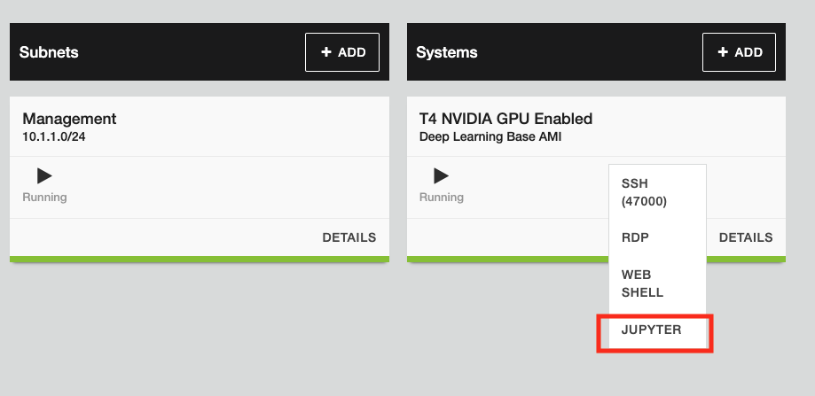

JupyterLab will open directly in your browser. No login or token is required.

> **Having trouble?** If the page doesn't load, wait a moment and refresh. The Jupyter server starts automatically on boot and may take a minute after the instance starts. If it still doesn't load, raise your hand and an instructor will help.

Now skip ahead to **[Navigating JupyterLab](#navigating-jupyterlab)**.

---

### Option B: RDP Access (Alternative)

Use this method if you prefer a full Ubuntu desktop experience. You will need an RDP client installed on your machine.

> **Note:** We are using RDP for this Linux box, so you will need a Windows RDP client (or compatible alternative).

#### Step 1: Access Your Lab Environment

Log into your UDF lab. Your instructor will provide the password location.

1. Find the **T4 NVIDIA GPU Enabled** system
2. Click **Access → RDP**

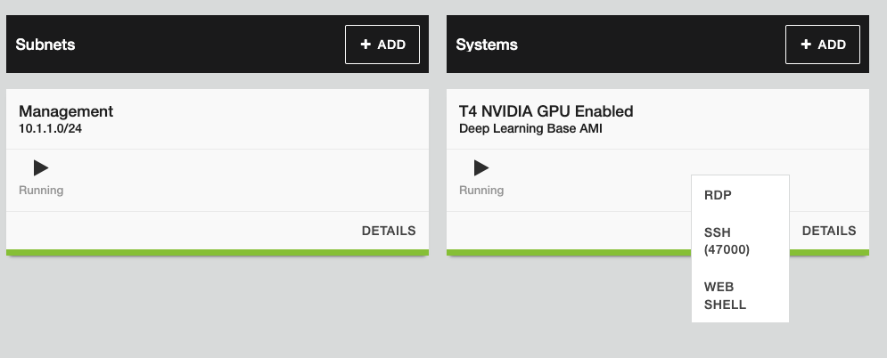

#### Step 2: Log Into the Desktop

The login screen may take a minute or two to appear.

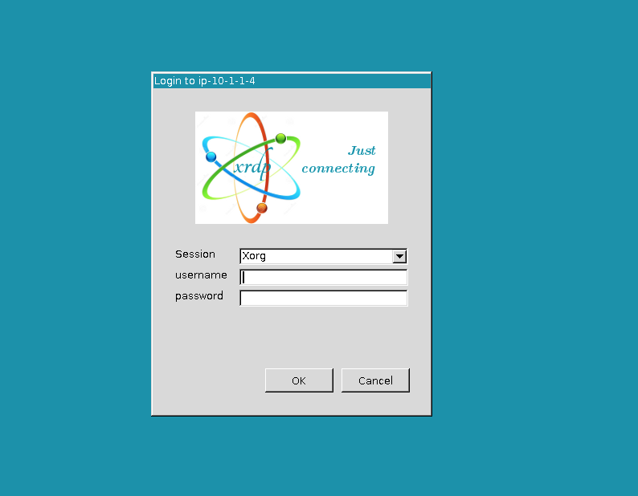

> **Having trouble?** If you get an error, please raise your hand and an instructor will help.

You may be prompted to authenticate again. If so, enter the same password or hit cancel.

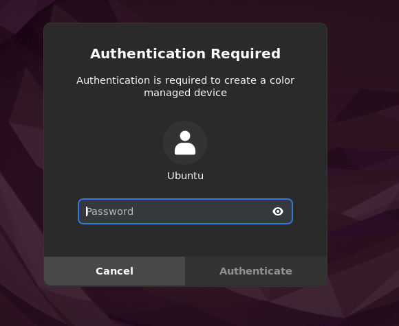

#### Step 3: Open JupyterLab in Browser

The Jupyter Lab server starts automatically on boot — no manual setup is needed.

1. **Open Firefox browser**
2. Navigate to `http://localhost:8888/lab`

You should see the JupyterLab interface:

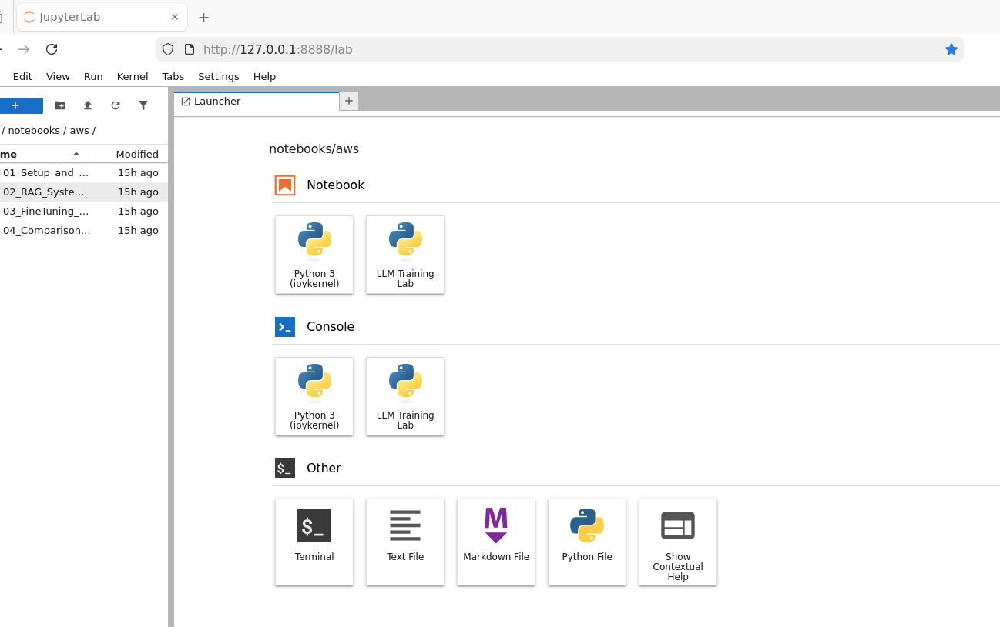

> **Jupyter not loading?** If the server is not running, you can start it manually. Open a Terminal and run:
>
> ```bash
> sudo su
> cd /root/llm-finetuning-rag-lab
> source venv/bin/activate
> jupyter lab --allow-root
> ```
>
> After running these commands, you should see a successful Jupyter server spin up:
>
> 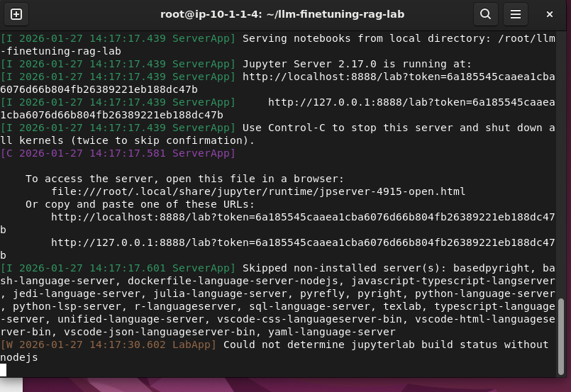

---

## Navigating JupyterLab

### Working Directory

We will be working from the **`/notebooks/aws/`** directory. You'll see this in the top left, just above the first notebook.

> **Note:** This should already be set for you. If you wanted to run these in Google Colab, there are other notebooks for that environment. For this lab, stay in the AWS directory.

### The Four Notebooks

You will run **4 notebooks in sequence**:

| Order | Notebook | Description |
|-------|----------|-------------|
| 1 | `01_Setup_and_Base_Model.ipynb` | Environment setup and baseline evaluation |
| 2 | `02_RAG_System.ipynb` | Build the RAG pipeline |
| 3 | `03_FineTuning_QLoRA.ipynb` | Fine-tune with QLoRA |
| 4 | `04_Comparison_Evaluation.ipynb` | Compare and evaluate results |

The first notebook should already be loaded for you if not double-click on the first notebook to open it:

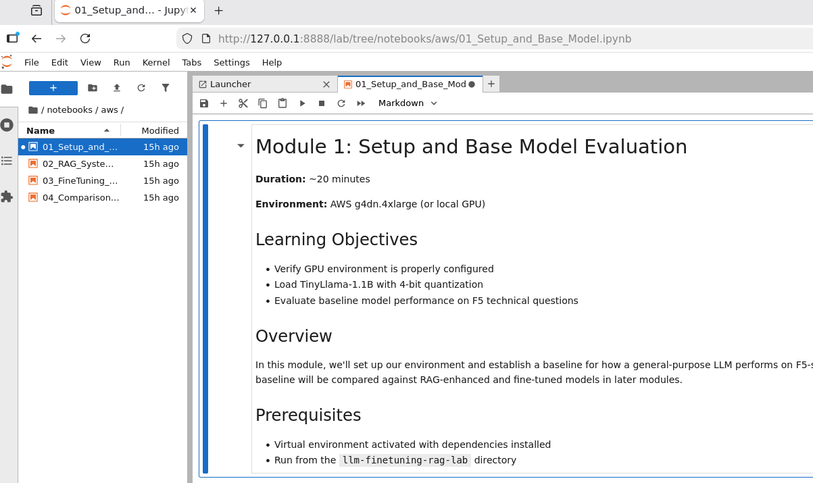

---

## Working with Notebooks

If you've never worked in a notebook app like Jupyter before, don't worry—it's fairly straightforward once you click around a bit.

### Key Interface Elements

There are two primary areas you'll be interacting with:

#### 1. Run Cell Button

Click the **play button** (▶) in the toolbar to run the selected cell and advance to the next one:

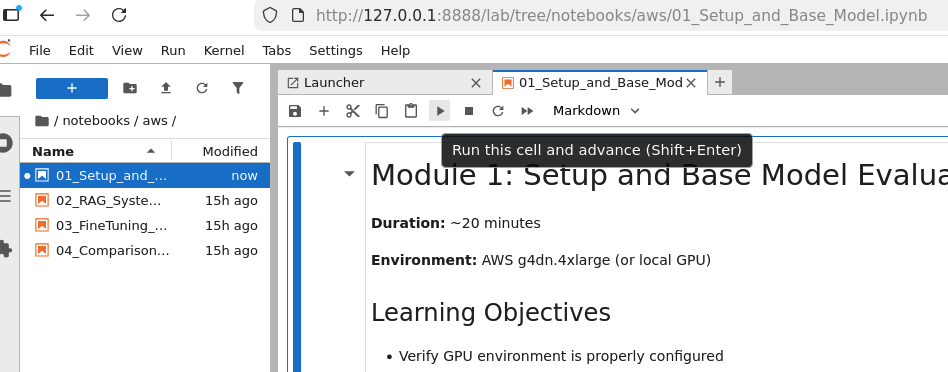

#### 2. Kernel Selector

**Critical:** Make sure you select the correct kernel after opening each module. If you get errors when running code, check the kernel first.

The kernel selector is in the **top right corner**:

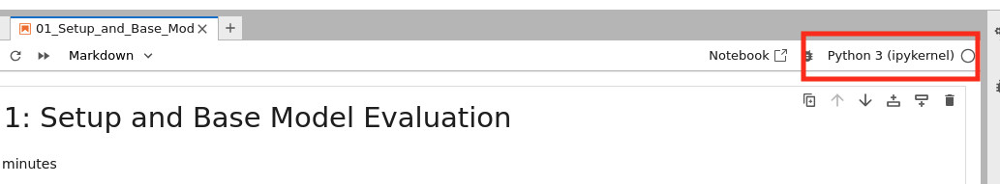

We need to use the **LLM Training Lab** kernel, which is connected to the GPU runtime:

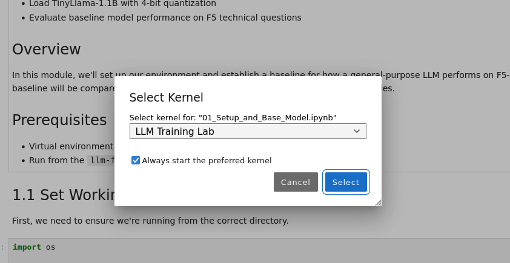

---

## Running Your First Cell

### Understanding Cells

Sections in the notebook are called **"cells"**. When you click on a cell, you'll notice a **blue bar** on the left side—this indicates the cell is selected.

### Execute the First Cell

With the correct kernel selected, let's run the first cell by clicking the **play icon** in the toolbar:

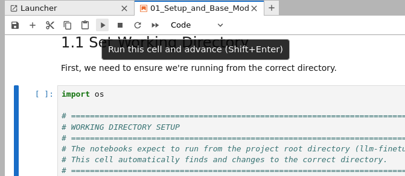

The first code cell is a helper function to ensure we're in the correct directory:

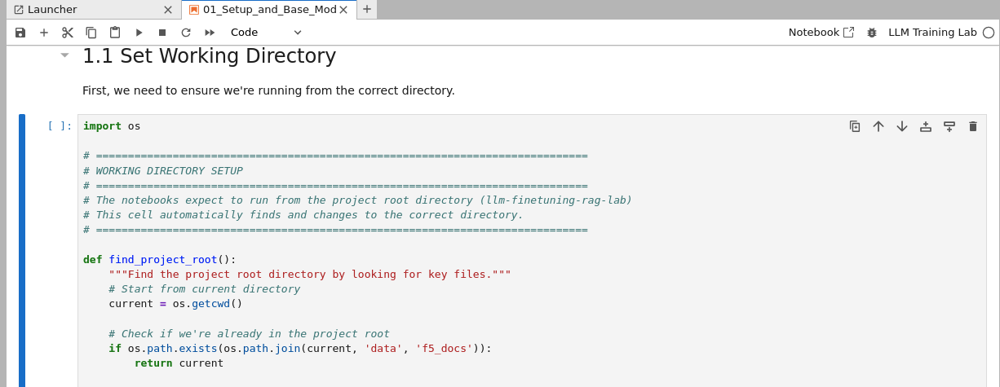

After the code runs, it produces output at the bottom:

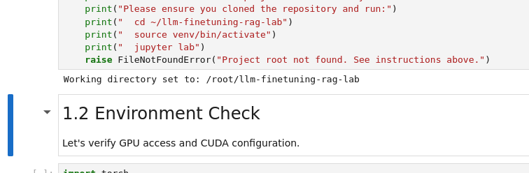

Notice that it automatically moved to the next cell.

### Checking Execution Status

Sometimes there's no obvious indication that code is still running. You can check by looking at the **circle next to the kernel name** in the top right:

| Circle State | Meaning |
|--------------|---------|
| **Grey/Filled** | Code is executing |
| **Clear/White** | Execution complete |

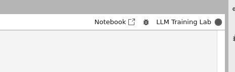

### Verify GPU Access

Continue to check that we have GPU access and CUDA is set up. When complete, you'll see output like this:

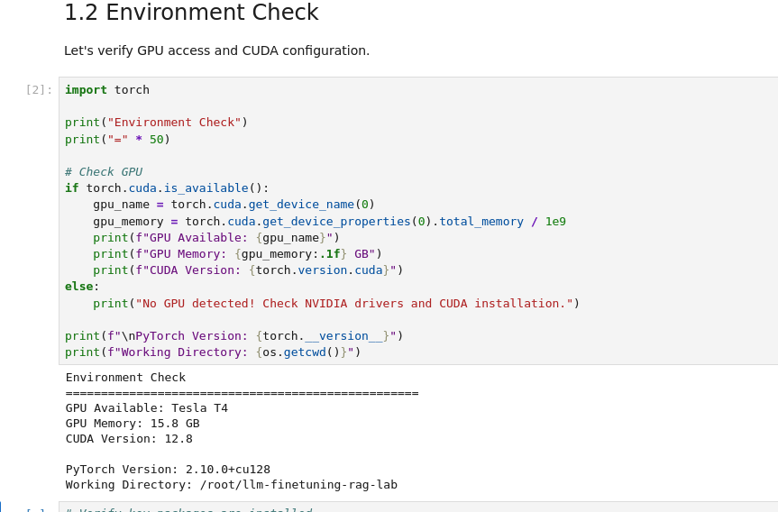

---

## Working Through the Lab

Now that you understand the basics, work **sequentially through the notebooks**. You will:

1. **Build pipelines** for document processing
2. **Import RAG documents**, chunk them, and process them into vectors
3. **Fine-tune the model** using QLoRA
4. **Compare RAG vs Fine-tuning** approaches
5. **View all responses** and reflect on the results

### Tips for Success

| Do This | Why |
|---------|-----|
| Read the code comments | Understanding what each section does helps you learn |
| Run cells in order | Some cells depend on previous outputs |
| Check the kernel if errors occur | Wrong kernel is the #1 cause of issues |
| Raise your hand if stuck | Instructors are here to help |

### Explore the Code

You may be surprised to learn that it takes **very little code** to run these complicated processes. The magic is in the tools used to make this work.

> **Want to learn more?**
> - Pay attention to the tools and libraries used
> - If unfamiliar, Google them or visit the [Technology Stack](TECHNOLOGY_STACK.md) documentation
> - For deeper understanding of the data flow, see the [Data Flow Design](DATA_FLOW_DESIGN.md) document

---

## Troubleshooting Quick Reference

| Problem | Solution |
|---------|----------|
| Jupyter won't load in browser (Option A) | Wait a minute and refresh — the server starts automatically on boot but may take a moment |
| Code won't run | Check that you're using the **LLM Training Lab** kernel |
| Import errors | Restart the kernel and run cells from the beginning |
| GPU not detected | Verify with `torch.cuda.is_available()` — should return `True` |
| File not found | Ensure working directory is set to `/root/llm-finetuning-rag-lab` |
| Session frozen | Restart the kernel (Kernel → Restart) |

For more detailed troubleshooting, see [TROUBLESHOOTING.md](TROUBLESHOOTING.md).

---

## Conclusion

Remember, this lab is **not intended to make you an expert** in LLM augmentation. It is meant to **introduce you to a section of the data science world**.

By the end of this lab, you should understand:
- The difference between RAG and fine-tuning approaches
- When to use each technique
- How to evaluate and compare model outputs
- The tools and frameworks that make this possible

We hope this lab accomplishes that objective. Happy learning!

---

## Additional Resources

| Resource | Description |
|----------|-------------|
| [README.md](../README.md) | Project overview and setup instructions |
| [TECHNOLOGY_STACK.md](TECHNOLOGY_STACK.md) | Detailed explanation of all technologies used |
| [DATA_FLOW_DESIGN.md](DATA_FLOW_DESIGN.md) | How data moves through the system |
| [INSTRUCTOR_GUIDE.md](INSTRUCTOR_GUIDE.md) | Teaching notes and timing suggestions |
| [TROUBLESHOOTING.md](TROUBLESHOOTING.md) | Common issues and solutions |
